```mermaid
flowchart TD
    subgraph START["🚀 Start"]
        A[traktor runs] --> B[Load .env config]
    end

    subgraph CHECKS["🔍 Pre-Sync Checks"]
        B --> C{Integrity check?}
        C -->|Fail| D{Continue?}
        C -->|Pass| E
        D -->|No| F[Exit]
        D -->|Yes| E
        E[Check credentials] --> G{Trakt + Plex<br/>credentials valid?}
        G -->|No| F
        G -->|Yes| H
    end

    subgraph AUTH["🔐 Authentication"]
        H{OAuth needed?} -->|Yes| I[Auth with Trakt]
        H -->|No| J[Skip auth<br/>Official lists only]
        I -->|Success| K[Initialize Trakt client]
        I -->|Fail| F
        J --> L
        K --> L
    end

    subgraph PLEX["📺 Plex Setup"]
        L[Connect to Plex] --> M[Build library cache]
        M --> N[Cache movies & shows<br/>by IMDB/TMDB IDs]
        N --> O[Initialize PlexClient]
    end

    subgraph LIKED["❤️ Liked Lists Sync"]
        P[Fetch liked lists<br/>from Trakt] --> Q{Lists found?}
        Q -->|No| R
        Q -->|Yes| S[Process each list]
        S --> T[Fetch list items<br/>from Trakt API]
        T --> U[Match items to Plex<br/>by IMDB/TMDB ID]
        U --> V{Found?}
        V -->|Yes| W[Resolve shows to S01E01<br/>or fallback episode]
        V -->|No| X[Record missing item<br/>with reason]
        W --> Y[Create/update<br/>Plex playlist]
        Y --> Z[Delta updates:<br/>only add/remove changes]
        X --> AA
        Z --> AA
        AA{More lists?} -->|Yes| S
        AA -->|No| R
    end

    subgraph OFFICIAL["📈 Official Lists Sync"]
        AB[Fetch official lists<br/>Trending/Popular/etc.] --> AC[Process each endpoint]
        AC --> AD[Aggregate items<br/>by period]
        AD --> AE[Match to Plex library]
        AE --> AF[Create/update playlists]
    end

    subgraph WATCH["👁️ Watch Status Sync"]
        AG{--sync-watched?} -->|Yes| AH[Fetch watch history<br/>from Trakt & Plex]
        AH --> AI[Compare watched states]
        AI --> AJ[Resolve conflicts<br/> newest/plex/trakt wins]
        AJ --> AK[Apply changes<br/>bidirectional]
        AG -->|No| AL
        AK --> AL
    end

    subgraph PROGRESS["⏯️ Progress Sync"]
        AM{--sync-progress?} -->|Yes| AN[Fetch resume points<br/>from Trakt]
        AN --> AO[Update Plex<br/>progress]
        AM -->|No| AP
        AO --> AP
    end

    subgraph COLLECTION["📦 Collection & Watchlist"]
        AQ{--sync-collection?} -->|Yes| AR[Sync Trakt collection<br/>to Plex playlist]
        AS{--sync-watchlist?} -->|Yes| AT[Sync Trakt watchlist<br/>to Plex playlist]
        AR --> AU
        AT --> AU
        AQ -->|No| AU
        AS -->|No| AU
    end

    subgraph CLEANUP["🧹 Cleanup"]
        AU --> AV[Write missing.txt<br/>with reasons]
        AV --> AW[Delete orphaned playlists<br/>no longer in Trakt]
        AW --> AX[Print summary stats]
    end

    %% Connections
    O --> P
    O --> AB
    R --> AG
    AF --> AG
    AL --> AM
    AP --> AQ
    AP --> AS
    AX --> AY[End]

    %% Styling
    style A fill:#e1f5fe
    style F fill:#ffccbc
    style AY fill:#c8e6c9
    style CHECKS fill:#fff3e0
    style AUTH fill:#f3e5f5
    style PLEX fill:#e8f5e9
    style LIKED fill:#fce4ec
    style OFFICIAL fill:#e3f2fd
    style WATCH fill:#f1f8e9
    style PROGRESS fill:#e0f7fa
    style COLLECTION fill:#fff8e1
    style CLEANUP fill:#f5f5f5
```

# Traktor Sync Flowchart

## What the script does step by step:

### 1. **Pre-Sync Checks** 🔍
- Validates integrity of config, tokens, and cache
- Checks Trakt and Plex credentials are set
- Optionally creates a pre-sync backup

### 2. **Authentication** 🔐
- If syncing liked lists or watch status: OAuth with Trakt
- If only official lists: no auth needed (just Client ID)
- Initializes Trakt API client

### 3. **Plex Setup** 📺
- Connects to Plex server
- Builds in-memory cache of all movies/shows indexed by IMDB/TMDB IDs
- Cache is saved to disk for fast subsequent runs

### 4. **Liked Lists Sync** ❤️
- Fetches your liked lists from Trakt
- For each list:
  - Fetches items from Trakt API
  - Matches items to Plex library by IMDB/TMDB ID
  - Shows resolve to S01E01 (or first available episode if S01E01 missing)
  - Creates/updates Plex playlist
  - **Smart delta updates**: only adds/removes changed items

### 5. **Official Lists Sync** 📈
- Fetches public Trakt lists (trending, popular, box office, etc.)
- No OAuth required — just Client ID
- Matches and creates playlists same as liked lists

### 6. **Watch Status Sync** 👁️ *(optional)*
- Fetches watch history from both Trakt and Plex
- Compares watched states
- Resolves conflicts (newest wins / Plex wins / Trakt wins)
- Applies changes bidirectionally

### 7. **Progress Sync** ⏯️ *(optional)*
- Fetches resume points from Trakt
- Updates Plex progress so you can resume where you left off

### 8. **Collection & Watchlist** 📦 *(optional)*
- Syncs Trakt collection to Plex playlist
- Syncs Trakt watchlist to Plex playlist

### 9. **Cleanup** 🧹
- Writes `missing.txt` report with reasons for unmatched items
- Deletes orphaned playlists (lists you un-liked on Trakt)
- Prints summary with stats

## Key Features

| Feature | How it works |
|---------|-------------|
| **Delta updates** | Only adds/removes changed playlist items instead of recreating entire playlists |
| **Smart fallback** | Shows without S01E01 fall back to first available episode |
| **Actionable reports** | `missing.txt` includes why each item wasn't found |
| **Incremental cache** | Only rescans new items since last sync |
| **Batch operations** | Processes 100 items per API call for speed |
| **Conflict resolution** | Handles disagreements between Trakt and Plex watch status |

## Cron Schedule

Your traktor runs **twice daily**:
```
0 6,18 * * *  →  06:00 and 18:00 every day
```

## Log file

```
/home/remcov/traktor/data/logs/traktor-cron.log
```
